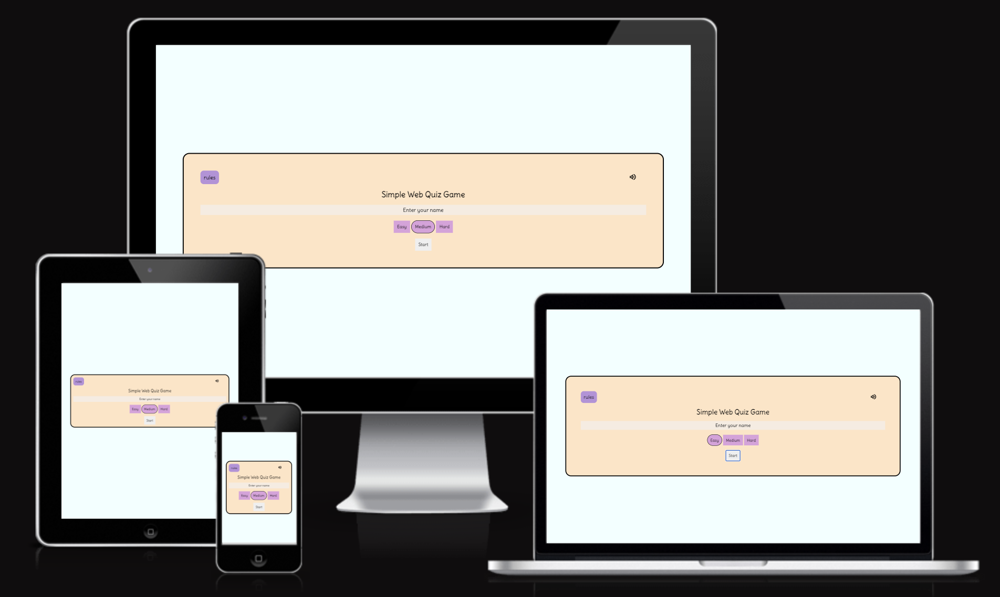
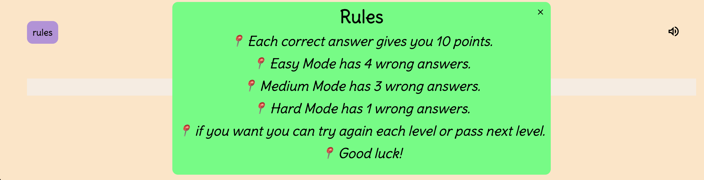

# Web Quiz

 [Web Quiz](https://mervecoskunn.github.io/Web-Quiz/) This is a quiz project. It is designed for users to test themselves on the HTML, CSS and Javascript fields required for web design.

 It is a quiz with 3 difficulty levels, 10 questions at each level, and score and time information can be easily accessed.

 A small area is reserved for users to give feedback just below the score page at the end of the quiz.  

# User Experience(UX)

### User Stories:
  * As a user, I want to be able to easily understand the purpose of the site when I open it.
  * As a user, I want to easily access and understand the rules I need to follow.
  * As a user, I want to easily navigate between pages on the site.
  * As a user, I want to start the quiz easily and access the questions without any problems.
  * As a user, I want to be supported with reactions appropriate to my correct or incorrect answers when answering quiz questions.    
  * As a user, I want to see my success rate at the difficulty level I choose.
  * As a user, I want to be clearly guided to easily advance to other levels or try the same level again if I wish.
  * As a user, I want to be able to contact the admin of the quiz program if I want.
  
## Wireframes
   I roughly designed the project using [wireframs.cc](https://wireframe.cc/)

   #### Welcome Screen

  #### Question Screen

  #### Result Screen

## Site Structure

This quiz project has been prepared in a simple and understandable way. When the user visits for the first time, the welcome screen will greet her and user will see a pop-up window button explaining the rules on the page in the upper left corner.When user clicks on this button, user will have access to all the information user needs to know.

There will be a volume button in the upper right corner that user can turn on and off if user wants.

The user will be prompted to enter a username which will then be used to address the user. Then, by selecting the difficulty level he wants to start with and clicking the start button, user will access the quiz questions and the duration will also become active for the user.

When the user comes to the question page and confirms by ticking the question he wants, the correct and incorrect answers to the question will be shown with the higlighter features, and if the user uses the sound effect on, the appropriate sound effect will be heard depending on whether the user answers correctly or incorrectly.
When the selected level comes to an end, the user will be shown the result screen and all information will be shared openly here. And if the user wants, user can play the same level again or move on to the next level.

## Design Choices

 ### Typography:

  * The font style ("Delius",cursive) form. I aimed to make the user feel comfortable by using a writing style that was legible and not too formal.

### Color Schema
  
  * I took care to use relaxing and warm colors. I generally used purple and its shades and the eye-friendly biscuit color as the background color.
  * I used blue colors if the questions were selected, and red and green colors, which are more eye-catching, to show correct and incorrect answers. Since these are generally used colors, I aimed to enable the user to act quickly with a familiar situation and judgment in these situations.
  
## Features

### Existing Features

- Rules pop-up
 - Designed to give the user an introduction to the site and to explain the rules of the game.
 - Three difficulty levels have been determined in the quiz, and explanatory information has been shared about how many mistakes user can make at these levels, how user can move on to the next level, or how user can end the quiz.

- Welcome Screen
  - In the Welcome Screen, the user must enter a username of at least 3 letters.
  - User can check the rules by clicking the Rules button.
  - The user can turn the sound on or off if user wishes from the sound icon.
  - After entering the username, you can start the quiz by clicking the start button.
  - 
  
