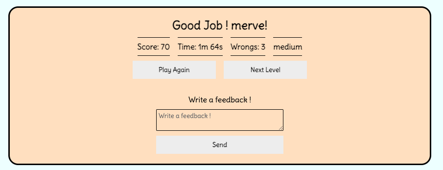

# Web Quiz

 [Web Quiz](https://mervecoskunn.github.io/Web-Quiz/) This is a quiz project. It is designed for users to test themselves on the HTML, CSS and Javascript fields required for web design.

 It is a quiz with 3 difficulty levels, 10 questions at each level, and score and time information can be easily accessed.

 A small area is reserved for users to give feedback just below the score page at the end of the quiz.  

# User Experience(UX)

### User Stories:
  * As a user, I want to be able to easily understand the purpose of the site when I open it.
  * As a user, I want to easily access and understand the rules I need to follow.
  * As a user, I want to easily navigate between pages on the site.
  * As a user, I want to start the quiz easily and access the questions without any problems.
  * As a user, I want to be supported with reactions appropriate to my correct or incorrect answers when answering quiz questions.    
  * As a user, I want to see my success rate at the difficulty level I choose.
  * As a user, I want to be clearly guided to easily advance to other levels or try the same level again if I wish.
  * As a user, I want to be able to contact the admin of the quiz program if I want.
  
## Wireframes
   I roughly designed the project using [wireframs.cc](https://wireframe.cc/)

   #### Welcome Screen

  #### Question Screen

  #### Result Screen

### OPPS! GAME OVER :(
The user encounters 10 questions in each level and must answer at least 5 of these questions correctly if the user wants to move on and try the next level. In this case, if the user gets less than 50 points, user will encounter a warning and a button to try the same level again.

### GOOD JOB ! 
Another situation that may be encountered is if the user obtains a score of 50 points or above but up to 90 points, then the user will be faced with another result screen and the user can pass to the next level or try the same level again if user wishes.

### CONGRATULATIONS !
If the user obtains a score of 90 points or above, this time the user will be greeted with a result screen as seen in the screenshot above.

## Site Structure

This quiz project has been prepared in a simple and understandable way. When the user visits for the first time, the welcome screen will greet her and user will see a pop-up window button explaining the rules on the page in the upper left corner.When user clicks on this button, user will have access to all the information user needs to know.

There will be a volume button in the upper right corner that user can turn on and off if user wants.

The user will be prompted to enter a username which will then be used to address the user. Then, by selecting the difficulty level he wants to start with and clicking the start button, user will access the quiz questions and the duration will also become active for the user.

When the user comes to the question page and confirms by ticking the question he wants, the correct and incorrect answers to the question will be shown with the higlighter features, and if the user uses the sound effect on, the appropriate sound effect will be heard depending on whether the user answers correctly or incorrectly.
When the selected level comes to an end, the user will be shown the result screen and all information will be shared openly here. And if the user wants, user can play the same level again or move on to the next level.

## Design Choices

 ### Typography:

  * The font style ("Delius",cursive) form. I aimed to make the user feel comfortable by using a writing style that was legible and not too formal.

### Color Schema
  
  * I took care to use relaxing and warm colors. I generally used purple and its shades and the eye-friendly biscuit color as the background color.
  * I used blue colors if the questions were selected, and red and green colors, which are more eye-catching, to show correct and incorrect answers. Since these are generally used colors, I aimed to enable the user to act quickly with a familiar situation and judgment in these situations.
  * Here you can see the colors and color codes used in the project.

  
## Features

### Existing Features

- Rules pop-up
 - Designed to give the user an introduction to the site and to explain the rules of the game.
 - Three difficulty levels have been determined in the quiz, and explanatory information has been shared about how many mistakes user can make at these levels, how user can move on to the next level, or how user can end the quiz.

- Welcome Screen

  - User can check the rules by clicking the Rules button.
  - The user can turn the sound on or off if user wishes from the sound icon.
  - In the Welcome Screen, the user must enter a username of at least 3 letters.
  - If the user writes a username outside these rules, then user will encounter this warning.
  
  - After entering the username, you can start the quiz by clicking the start button.
  
  

- Question Screen
  - When the user comes to the question page, user will see information about the time period, which question user is on and the mistakes user can make in the bar above.
  - The user can go to the welcome screen, that is, the home page, by clicking the home button whenever user wants.
 

  - When the user makes a selection, the selected favorite will be displayed to the user with a blue highlighter feature.
  

  - If the user will approve the selected number, the answer will be added to the control system by pressing the comfirm button.
  - and if the result of the check is correct, it is confirmed with the green highlighter feature and at the same time, if the sound is on, it is confirmed with the sound effect. If the answer is incorrect, the selected answer is shown in red, and the correct answer is shown in green.
  - Another feature is that if the user wants to skip the question without answering it, user will just have to press the next button.
  - For each level, the user is given the right to make a predetermined number of mistakes, and these rights are counted backwards during the quiz. If the user has made the maximum mistake user can make for the level he has chosen, that level is finished for that moment and sent to the result screen. If the user wishes, user can try again in the same way or go to the next level and try users luck there.
  

  - After all the questions at the level chosen by the user are answered, that is, after all 10 questions are answered, the result screen will appear and here you will find all the information about the game and the score.
  - If the user wishes, user can try the same level again or if the user have already minimum 50 points in this level so user can  move on to the next level.
  
  - After the user has accessed the information about the score, a box has been added so that the project owner can give us feedback so that we can be better, and when the send button is clicked after the message he writes there, an e-mail will be sent to our previously determined e-mail address.
  - 
### If user have less than 50 points.

### If user have minimum 50 points maximum 80 points.

### If user have 90 or 100 points.

## The Web Quiz
  - Web Quiz project consists of Html Css and Javascript questions.
  - Among the 56 questions in the JSON file, 10 questions are random asked to the user for each level.
  - The purpose of the game is a small challenge to test the level of users who are trying to improve themselves in this field.
  - This quiz is of course not an official criterion.

## Feature Features
  - Taking into account the feedback from users, more content, questions on new topics and new rules can be added.
  
# Technologies Used

  - [HTML5](https://www.w3schools.com/html/default.asp) - All content and structure of the quiz project has been created.
  - [CSS](https://www.w3schools.com/css/default.asp) -  All colors and page designs of the quiz project were created.
  - [JavaScript](https://www.w3schools.com/js/default.asp) - provides the interactivity.
  - [Wireframe.cc](https://wireframe.cc/) - used to create the wireframes.
  - [Gitpod](https://www.gitpod.io/#get-started) - used to deploy the website.
  - [Github](https://github.com) - used to host and edit the website. 

# Testing

## Code Validation

Web Quiz has be throughly tested. All the code has been run through the [W3C html validator](https://validator.w3.org/), the [W3C CSS validator](https://jigsaw.w3.org/css-validator/) and the JavaScript [JSHint validator](https://jshint.com/). The code passed all of the validators once minor points had been corrected.

The HTML validator results are here:

The CSS validator results are here:

Javascript validation was done via [JsHint](https://jshint.com/) and updated with necessary changes.

# Deployment

### To deploy the project

The site was deployed to GitHub pages. The steps to deploy a site are as follows:

1. In the GitHub repository, navigate to the Settings tab.

2. Once in Settings, navigate to the Pages tab on the left hand side.

3. Under Source, select the branch to master or main, then click save.

4. Once the main branch has been selected, the page will be automatically refreshed with a green ribbon display to indicate the successful deployment.

The live link to the Github repository can be found here: 

[Web Quiz Live Link](https://mervecoskunn.github.io/Web-Quiz/)

# Credits

## Content
  * The font came from [Google Fonts](https://fonts.google.com/)
  * [Wireframe.cc](https://wireframe.cc/)used to create the wireframes.
  * [Chatgpt](https://chat.openai.com/) was used in the json file to create 56 questions.
  * [Emailjs](https://www.emailjs.com/) was used for the feedback mail system.
  * The icons used in the project were taken through [Google Material Icons](https://developers.google.com/fonts/docs/material_icons) and used in the project.
  * Sound files with correct and incorrect effects used in the project were taken from [YouTube](https://www.youtube.com/results?search_query=wrong+sound+effect).
  * An online editor audio program was used to shorten the waiting times at the beginning and end of the sound effects used.[Editor audio](https://editor.audio/)

# Acknowledgements

Web Quiz was completed as a Portfolio Project-2 piece for the Full Stack Software Developer Diploma at the [Code Institute](https://codeinstitute.net/se/). As such I would like to thank my mentor [Precious Ijege](https://www.linkedin.com/in/precious-ijege-908a00168/).

Merve Coskun 2023.

